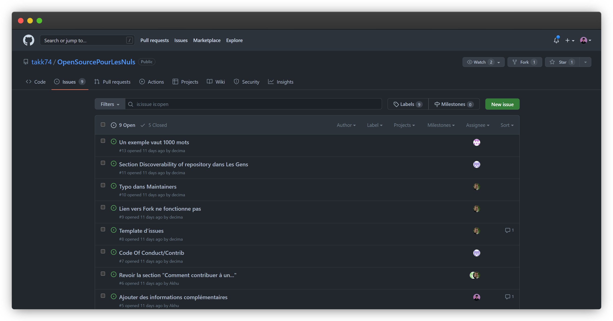
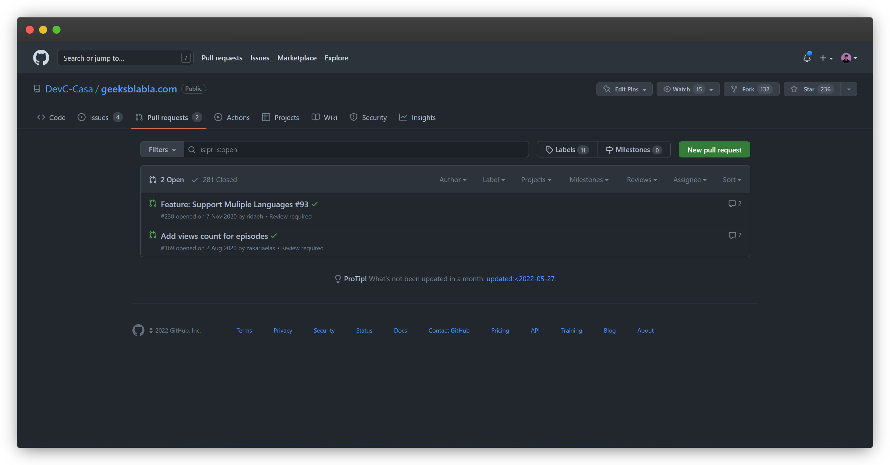
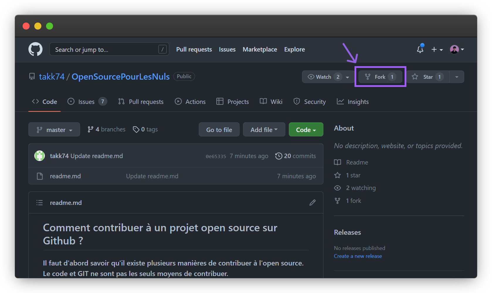
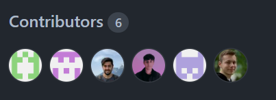

## Comment contribuer à un projet open source sur Github ?

**Il faut d'abord savoir qu'il existe plusieurs manières de contribuer à l'open source. Le code et GIT ne sont pas les seuls moyens de contribuer.**

### Pour en savoir plus sur GIT : [Git pour les Nuls](https://github.com/takk74/GitPourLesNuls)

0. Chercher une issue intéressante : [GoodFirstIssue] 👀(https://goodfirstissue.dev/language/csharp)
1. [Fork](#Forking)
2. Clone : `git clone https://github.com/NAMESPACE/REPONAME.git` (cf. [Pour en savoir plus sur GIT](#Pour-en-savoir-plus-sur-GIT))
3. Lire les documents texte du projet (readme, contributing, ...) 📖
4. Coder en respectant le guide de contribution 👨 (cf. [Pour en savoir plus sur GIT](#Pour-en-savoir-plus-sur-GIT))
5. Commit : `git add --all && git commit -m 'COMMIT-EXPLICITE'` (cf. [Pour en savoir plus sur GIT](#Pour-en-savoir-plus-sur-GIT))
6. Fetch source : `git fetch origin` (cf. [Pour en savoir plus sur GIT](#Pour-en-savoir-plus-sur-GIT))
7. Créer une pull request afin que le possesseur l'accepte et merge le code ! (cf. [https://docs.github.com/en/pull-requests/collaborating-with-pull-requests/proposing-changes-to-your-work-with-pull-requests/creating-a-pull-request](#Comment-créer-pull-request))
8. Communication / feedback 💬
9. Pull request acceptée ✅

# Introduction
## L'interet de l'open source ?
Un logiciel open source est un logiciel comportant un code source que n’importe qui peut inspecter, modifier et améliorer.

Le « code source », c’est en fait la partie du logiciel que la plupart des utilisateurs d’ordinateurs ne voient jamais lors d’un projet : c’est le code que les programmeurs informatiques manipulent pour changer le fonctionnement d’un logiciel ou d’une application. Les programmeurs qui ont accès au code source d’un logiciel informatique peuvent l’améliorer en y ajoutant des fonctionnalités selon leur propre projet ou modifier certains aspects qui ne fonctionnent pas toujours correctement.

## Les valeurs
Ce mouvement s'est organisé autour de l'idée des libertés des utilisateurs : la liberté d'accéder au code source, de le modifier et de le redistribuer, pour le rendre disponible à d'autres personnes, qui peuvent ensuite en faire ce qu'elles veulent.

## La finalité 
« Open source » désigne un logiciel ou un projet dans lequel le code source est à la disposition du grand public, et c'est le plus souvent un effort de collaboration où les programmeurs améliorent ensemble le code source et partagent les changements au sein de la communauté ainsi que d'autres membres peuvent contribuer.

# Pourquoi faire de l'open source ?
Un projet Open Source permet de rassembler davantage de développeurs. Au lieu d'avoir un projet privé, d'autres cerveaux peuvent venir vous aider à contribuer au développement. Cela permet aussi d'ajuster un logiciel en fonction des besoin de chacun. Par exemple, il est possible de créer des modules sur le Headless CMS Strapi. 

# Concepts
## Propriétaire vs Open Source
Un logiciel propriétaire est un logiciel à licence. Celui-ci est développé et modifié par une entreprise ou un individuel. Il est impossible de modifier l'un de ces logiciels. L'Open Source quant à lui est entièrement modifiable (sous licence)

## Libre vs Open Source
Un logiciel libre permet à ses utilisateurs, qu'ils soient seuls ou en équipe, d'avoir la liberté d'exécuter, copier, distribuer, étudier, modifier et améliorer le logiciel. Un logiciel est qulifié tel quel quand il respecte les règles suivantes :

0. La liberté d'exécuter le programme comme vous le souhaitez, et à toute fin
1. La liberté d'étudier le fonctionnement du programme, et le modifier comme vous le souhaitez pour votre ordinateur
2. La liberté de redistribuer les copies que vous avez reçues
3. La liberté de distribuer des copies de vos versions modifiées pour donner à toute la communauté une chance de profiter de vos modifications

Un logiciel Open Source est en effet libre mais propose aussi son code en ligne avec la possibilité d'y contribuer
## Gratuit vs Open Source
Un logiciel free (gratuit) est un logiciel que n'importe qui peut télécharger sans contrepartie. Un logiciel Open Source n'est pas forcément gratuit.

# Les termes de l'open source / Dev

## Issue
> Les issues servent à suivre les idées, les commentaires, les tâches ou les bogues pour le travail sur GitHub.

## Contributing.md
> Un fichier de contributions est un fichier texte que les gestionnaires de projets incluent dans les packages de logiciels libres et open source pour décrire comment d'autres peuvent contribuer au projet.
## Readme.md
> Le fichier README est un fichier contenant des informations sur les autres fichiers du même répertoire ou sur le projet en lui même s'il est placé à la racine.
## CODE_OF_CONDUCT.md
> Permet de fixer les règles de base du comportement des participants associés et contribue à faciliter un environnement convivial et accueillant. Bien que tous les projets ne disposent pas d'un fichier CODE_OF_CONDUCT, sa présence signale qu'il s'agit d'un projet accueillant auquel contribuer. Voici aussi [notre CODE_OF_CONDUCT](CODE_OF_CONDUCT.md)

## Pull Request 
> Les Pull Requests vous permettent d'informer les autres des modifications que vous avez apportées à une branche d'un dépôt sur GitHub. Une fois qu'une demande de retrait est ouverte, vous pouvez discuter et revoir les changements potentiels avec des collaborateurs et ajouter des commits de suivi avant que vos changements ne soient fusionnés dans la branche de base.

## Forking
Un fork est une copie d’un dépôt que vous gérez. Forks vous permet de modifier un projet sans affecter le dépôt d’origine. Vous pouvez récupérer des mises à jour ou soumettre des modifications au dépôt d’origine avec des requêtes de tirage.

La bifurcation d’un dépôt est similaire à la copie d’un dépôt, avec deux différences majeures :

Vous pouvez utiliser une requête de tirage pour suggérer des modifications de votre fork appartenant à l’utilisateur vers le dépôt original dans son instance GitHub, également connu sous le nom de dépôt amont.
Vous pouvez apporter des modifications du dépôt amont à votre branche locale en synchronisant votre branche avec le dépôt amont.

# Les acteurs

## Author
Git stocke le nom et l’e-mail de deux personnes pour chaque commit : le participant et l’auteur. La différence entre les deux est que l’auteur est la personne qui a écrit les changements, tandis que le participant est la personne qui leur a téléchargé le dépôt.
## Owner
> La ou les personnes qui détiennent la propriété de l'organisation. 
## Maintainers 
> Les contributeurs responsables de maintenir l'organisation du projet (branches, commits, revues...)
## Contributors 
- Corentin PERROUX - <https://github.com/Corentin7301>
- Raphaël BEAUDET - <https://github.com/Raphy73>
- Arthur TASSOT - <https://github.com/takk74/>
- Corentin DELEUSE - <https://github.com/deleusec/>

## Discoverability of repository

**Topics :** Cette section de GitHub vous permettra de vous lancer dans le monde de l'open source en contribuant à toutes sortes de projets.

**Description :** La description d'un repository GitHub est importante pour comprendre rapidement la nature de votre projet. 

**Badge :** Un badge GitHub est l'équivalent d'un "tag". Il peut par exemple permettre de savoir l'avancé d'un projet, les technologies utilisées... 
Voici ci-dessous quelques exemples.

# Exemples 
- **Licences** : La licence Apache est une licence permissive, compatible avec la licence GNU GPL v3
- **Code of conduct** : Le code doit être enitèrement écrit en anglais. 
- **Contributing** : Liste l'ensemble des personnes, exemple : Développeur Raphaël, designer : Cédric...
